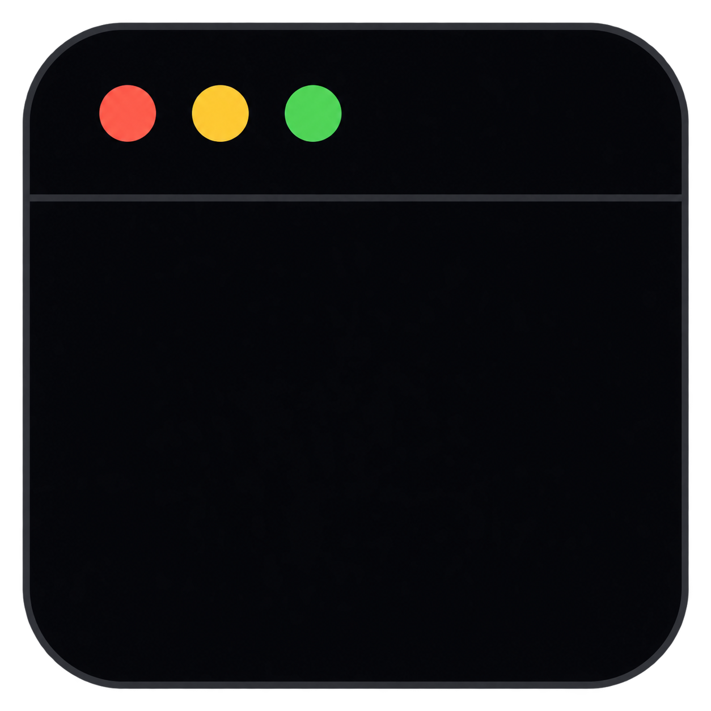

<p align="center">
  
</p>

<h1 align="center">CLI Terminal UI</h1>

<p align="center">
  A keyboard-first desktop AI workspace with native tools, persistent sessions, and a quiet terminal-inspired interface.
</p>

> [!NOTE]
> CLI Terminal UI is currently a private Windows pre-release. There is no public download yet.

CLI Terminal UI started with a simple question: what would it feel like to use an AI coding agent that kept the directness of a terminal without turning every response into a wall of raw text?

The result is a small Tauri desktop app built around one command input. You can switch providers, inspect a model connection, resume an earlier conversation, approve risky actions, and let the agent work with files and commands without leaving the window. Responses are rendered as readable Markdown, while tool activity stays compact and easy to scan.

It is intentionally restrained. There are no dashboards competing for attention, no account system, and no separate cloud service operated by this project.

## What it can do

- Connect to multiple AI providers from the same interface.
- Fetch each provider's current model catalog and cache its public metadata for offline menus.
- Stream native tool calls for files, code search, shell commands, web retrieval, and repository work.
- Render Markdown, code blocks, diffs, tables, task lists, callouts, and local file links.
- Save conversations locally with automatic titles, checkpoints, resume, deletion, and undo support.
- Compact long conversations manually or automatically at 80% of the active context window.
- Show session usage, estimated cost when pricing is configured, context consumption, API calls, and provider rate-limit data when the provider exposes it.
- Diagnose credentials, model catalogs, endpoints, tool support, latency, and provider-specific account information.
- Decide when tools need approval with smart, strict, or autonomous permission modes.
- Stay usable offline for saved sessions and cached model metadata.

## Supported providers

The provider layer currently includes:

- NVIDIA NIM
- OpenAI
- Anthropic
- Google Gemini
- Groq
- DeepSeek
- Together AI
- Fireworks AI
- OpenRouter
- Ollama running locally
- Custom OpenAI-compatible servers

Provider APIs change frequently. The app prefers live model catalogs and uses a curated fallback only when a catalog cannot be reached.

## First run

1. Open the app.
2. Choose a provider.
3. Enter the provider API key, or select Ollama for a local setup that does not require one.
4. Choose a model.
5. Type a request and press <kbd>Enter</kbd>.

Use <kbd>Esc</kbd> to stop an active response or close the current menu. Menus are designed for keyboard navigation with the arrow keys and <kbd>Enter</kbd>.

API keys are stored in Windows Credential Manager. They are not written into session files or the public model cache.

## Slash commands

Type `/` to open the command menu.

| Command | Purpose |
| --- | --- |
| `/model` | Choose a model from linked providers. |
| `/provider` | Add, switch, test, reconnect, or remove a provider. |
| `/diagnostics` | Inspect provider health and run a deeper connection test. |
| `/permissions` | Change how tool approvals are handled. |
| `/status` | Open the current session's usage and context summary. |
| `/compact` | Summarize older context without waiting for automatic compaction. |
| `/sessions` | Browse saved conversations. |
| `/resume` | Resume a saved conversation from the session picker. |
| `/delete-session` | Choose and permanently delete a saved conversation. |
| `/new` | Start a new conversation. |
| `/undo` | Restore the last file change captured by the local checkpoint system. |
| `/clear` | Clear the visible transcript without deleting the saved session. |

## Permission modes

AI tools can read and change real files, so the permission mode matters.

| Mode | Behaviour |
| --- | --- |
| `smart` | Reads automatically; writes and risky actions ask for approval. This is the default. |
| `strict` | Every action above low risk asks for approval. |
| `autonomous` | Runs permitted tools without approval prompts. Destructive command rules and critical-path protection still apply. |

The native layer rejects known destructive shell patterns and always requires approval around critical system paths. Treat autonomous mode with the same care you would give an unattended terminal process.

## Privacy and local data

- Provider credentials live in Windows Credential Manager under the app's credential service.
- Sessions and checkpoints are JSON files inside the Tauri application configuration directory.
- Session validation rejects secret-key fields and applies message and file-size limits.
- The frontend stores only public provider metadata and cached model names.
- The project does not include an analytics or advertising SDK.
- Requests still travel directly to the provider you select, under that provider's own terms and privacy policy.

## Build from source

### Requirements

- Windows 10 or Windows 11
- Node.js 20 or newer
- Rust stable with the `x86_64-pc-windows-msvc` target
- Microsoft C++ Build Tools
- Microsoft Edge WebView2 Runtime

Clone the repository and install the locked JavaScript dependencies:

```powershell
git clone https://github.com/Utku4836/cli-terminal-ui.git
cd cli-terminal-ui
npm ci
```

Run the development app:

```powershell
npm run dev
```

Run the full validation suite:

```powershell
npm run release:check
```

Build the application without installers:

```powershell
npm run build:app
```

Build the Windows installers:

```powershell
npm run build
```

Tauri writes release artifacts under `src-tauri/target/release/bundle/`.

## Development commands

| Command | What it runs |
| --- | --- |
| `npm run dev` | Opens the Tauri development app. |
| `npm test` | Runs all JavaScript UI and runtime tests. |
| `npm run test:rust` | Runs the Rust test suite. |
| `npm run check:rust` | Type-checks the native application. |
| `npm run benchmark:runtime` | Measures the UI runtime hot paths. |
| `npm run verify:release` | Verifies versions, metadata, security settings, icons, and release documents. |
| `npm run release:check` | Runs the checks required before producing a release candidate. |

## Project layout

```text
src/                     Browser-side UI, Markdown rendering, motion, and menus
src-tauri/src/           Rust commands, providers, sessions, tools, and security checks
src-tauri/icons/         Application icon source and generated platform icons
tests/                   DOM, Markdown, diagnostics, performance, and motion tests
benchmarks/              Runtime micro-benchmarks
.github/workflows/       CI and private draft-release automation
docs/                    Release checklist and maintainer notes
```

The frontend is plain HTML, CSS, and JavaScript. Rust owns credentials, provider requests, filesystem operations, session persistence, and the permission boundary. Tauri connects the two layers through explicit commands and capabilities.

## Release status

Version `0.1.0` is the first release candidate. The remaining public-release requirement is Windows code signing; unsigned installers can trigger a Microsoft SmartScreen warning.

See [CHANGELOG.md](CHANGELOG.md), [RELEASE_NOTES.md](RELEASE_NOTES.md), and [docs/RELEASE_CHECKLIST.md](docs/RELEASE_CHECKLIST.md) for the current release state.

## Security reports

Please do not post API keys, provider headers, session files, or private diagnostics in an issue. See [SECURITY.md](SECURITY.md) for the private reporting process.

## License

No public license has been granted yet. The repository remains private and the source is currently all rights reserved.
